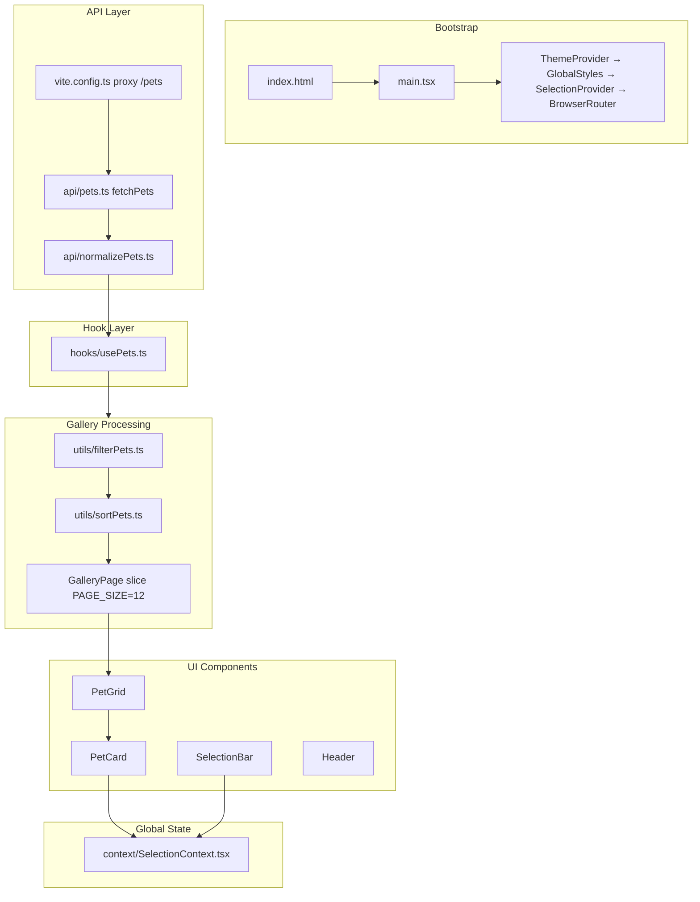
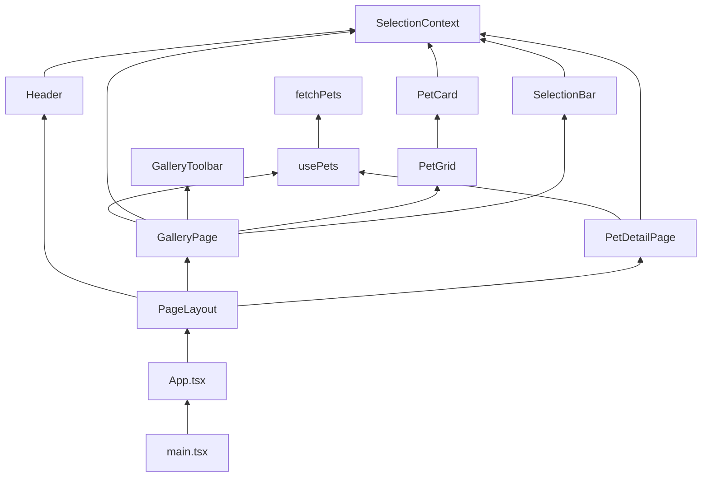

# Pet Gallery — End-to-End Learning Tutorial

A project-specific guide to understanding this codebase line-by-line and concept-by-concept. Built for the **Eulerity Pet Gallery** take-home project.

**Stack:** React 19 · TypeScript 6 · Vite 8 · react-router-dom 7 · styled-components 6

---

## Table of Contents

1. [Project Map](#1-project-map)
2. [Prerequisites](#2-prerequisites)
3. [Core TypeScript Syntax](#3-core-typescript-syntax-used-in-this-repo)
4. [Core React Principles](#4-core-react-principles-used-in-this-repo)
5. [styled-components Usage](#5-styled-components-usage-in-this-repo)
6. [react-router-dom Usage](#6-react-router-dom-usage-in-this-repo)
7. [Custom Hooks & UI States](#7-custom-hook-design-and-loadingerrorempty-states)
8. [Selection Persistence](#8-selection-persistence-across-routes)
9. [Filtering, Sorting, Pagination](#9-filtering-sorting-and-pagination)
10. [API Layer & Normalization](#10-api-layer-and-normalization)
11. [Responsive Layout Strategy](#11-responsive-layout-strategy)
12. [Download Flow](#12-download-flow)
13. [Guided Walkthroughs](#13-guided-walkthroughs)
14. [How Everything Connects](#14-how-everything-connects)
15. [Glossary](#15-glossary)
16. [4-Hour Study Plan](#16-4-hour-study-plan)

---

## 1. Project Map

### What this app does

Users browse a gallery of pet images fetched from an external API, search and sort results, paginate through them, multi-select pets, download selected images, and view individual pet details. Selection state survives navigation between routes while the app is open.

### Folder structure

| Path | Purpose |
|------|---------|
| `index.html` | HTML shell; mounts `#root`, loads `src/main.tsx` |
| `vite.config.ts` | Vite config; proxies `/pets` to the Eulerity hackathon API in dev/preview |
| `package.json` | Dependencies and npm scripts (`dev`, `build`, `lint`, `preview`) |
| `tsconfig.json` | Root TypeScript project references |
| `tsconfig.app.json` | TypeScript config for `src/` |
| `tsconfig.node.json` | TypeScript config for `vite.config.ts` |
| `eslint.config.js` | ESLint flat config |
| `README.md` | Setup instructions and feature list |
| `public/icons.svg` | Static asset (Vite template remnant) |
| **`src/main.tsx`** | App bootstrap and provider tree |
| **`src/App.tsx`** | Route definitions |
| **`src/styled.d.ts`** | TypeScript theme augmentation for styled-components |
| `src/types/pet.ts` | `PetApiRecord` (raw API) and `Pet` (normalized app model) |
| `src/api/pets.ts` | `fetchPets()` — fetch, parse, normalize |
| `src/api/normalizePets.ts` | Maps API records to `Pet[]`; estimates image file sizes |
| `src/hooks/usePets.ts` | Custom data-fetch hook with explicit status machine |
| `src/context/SelectionContext.tsx` | Global multi-select state via `useReducer` |
| `src/pages/GalleryPage.tsx` | Main gallery: filter, sort, paginate, grid |
| `src/pages/PetDetailPage.tsx` | Single-pet detail view |
| `src/pages/AboutPage.tsx` | Static about page |
| `src/pages/NotFoundPage.tsx` | 404 catch-all |
| `src/components/gallery/` | `PetGrid`, `PetCard`, `GalleryToolbar`, `Pagination` |
| `src/components/layout/` | `Header`, `PageLayout` |
| `src/components/selection/` | `SelectionBar` (fixed bottom download bar) |
| `src/components/ui/` | `Button`, `Input`, `Select`, `Spinner`, `StateMessage` |
| `src/utils/filterPets.ts` | Client-side search filter |
| `src/utils/sortPets.ts` | Client-side sort (name/date) |
| `src/utils/formatBytes.ts` | Human-readable byte formatting |
| `src/utils/downloadImages.ts` | Sequential image download via blob URLs |
| `src/styles/theme.ts` | Color, shadow, radius, spacing tokens |
| `src/styles/GlobalStyles.ts` | Global CSS reset and base typography |
| `src/styles/breakpoints.ts` | Responsive breakpoint constants |

> **Note:** `src/App.css` and `src/index.css` are unused Vite template leftovers — they are not imported anywhere.

### Data flow



**Step-by-step:**

1. Browser loads `index.html` → Vite serves `main.tsx`.
2. `fetchPets()` calls `GET /pets`. Vite dev/preview proxy forwards to `https://eulerity-hackathon.appspot.com/pets`.
3. `normalizePets()` assigns index-based IDs and estimates image sizes via HEAD requests.
4. `usePets()` exposes `{ pets, status, error, refetch }` to page components.
5. `GalleryPage` chains `filterPets` → `sortPets` → paginates 12 per page.
6. `PetGrid` → `PetCard` renders each pet; checkboxes update `SelectionContext`.
7. `SelectionBar` reads selected pets from the full list and triggers downloads.

### Routing flow

**Provider tree** (`src/main.tsx` lines 10–20):

```
StrictMode
  └── ThemeProvider
        └── GlobalStyles
              └── SelectionProvider
                    └── BrowserRouter
                          └── App
```

**Routes** (`src/App.tsx` lines 11–16):

| Path | Component | Purpose |
|------|-----------|---------|
| `/` | `GalleryPage` | Main pet gallery |
| `/pets/:id` | `PetDetailPage` | Detail view (`id` = array index as string) |
| `/about` | `AboutPage` | Static about page |
| `*` | `NotFoundPage` | Catch-all 404 |

All routes are wrapped in `PageLayout`, which renders a sticky `Header` and a centered `Main` content area.

### State flow

| State | Location | Scope | Persists across routes? | Persists on refresh? |
|-------|----------|-------|---------------------------|----------------------|
| `selectedIds: Set<string>` | `SelectionContext` | Global | Yes | No |
| `pets`, `status`, `error` | `usePets()` per caller | Per component mount | N/A | No |
| `search`, `sortBy`, `page` | `GalleryPage` local `useState` | Gallery only | No | No |
| `downloading` | `SelectionBar` local state | Transient | No | No |

> **Important nuance:** "Selection persists across routes" means in-memory only while the SPA is open — not `localStorage`. See `README.md` line 35.

### File references

- `index.html`, `src/main.tsx`, `src/App.tsx`
- `src/pages/*`, `src/context/SelectionContext.tsx`, `src/hooks/usePets.ts`
- `src/api/*`, `src/utils/*`, `vite.config.ts`, `README.md`

### Sources

- [Vite — Getting Started](https://vite.dev/guide/)
- [React — Installation](https://react.dev/learn/installation)

---

## 2. Prerequisites

Before diving into this repo, you should be comfortable with the following concepts.

### JavaScript fundamentals

| Concept | Why you need it here |
|---------|---------------------|
| ES modules (`import` / `export`) | Every file uses module syntax |
| `async` / `await` | API calls in `fetchPets`, `normalizePets`, `downloadImages` |
| `fetch` | All network requests |
| Promises | `Promise.all` in normalization, sequential downloads |
| Array methods (`filter`, `map`, `slice`, `sort`) | Filter, sort, paginate pets |
| `Set` | Selection state in `SelectionContext` |

### React fundamentals

| Concept | Why you need it here |
|---------|---------------------|
| JSX | All `.tsx` files |
| Components and props | Every UI file |
| Hooks (`useState`, `useEffect`, `useMemo`, etc.) | State and side effects throughout |
| Rules of Hooks | Hooks only at top level, only in React functions |
| Context | Global selection state |

### TypeScript basics

| Concept | Why you need it here |
|---------|---------------------|
| `interface` / `type` | `Pet`, `PetApiRecord`, props interfaces |
| Union types | `PetsStatus`, `SortOption` |
| Type annotations on functions | All utilities and hooks |
| `import type` | Type-only imports in API layer |

### SPA mental model

This is a **Single Page Application**. The browser loads one HTML page; React swaps page components in and out via react-router-dom without full page reloads. Data fetching happens in JavaScript after mount.

### File references

- All of `src/` — the entire codebase assumes these prerequisites.

### Sources

- [MDN — JavaScript modules](https://developer.mozilla.org/en-US/docs/Web/JavaScript/Guide/Modules)
- [MDN — async/await](https://developer.mozilla.org/en-US/docs/Web/JavaScript/Reference/Statements/async_function)
- [MDN — fetch](https://developer.mozilla.org/en-US/docs/Web/API/Window/fetch)
- [React — Learn React](https://react.dev/learn)
- [TypeScript — Handbook Intro](https://www.typescriptlang.org/docs/handbook/intro.html)

---

## 3. Core TypeScript Syntax Used in This Repo

TypeScript adds static types on top of JavaScript. This project uses a focused subset — no advanced generics or decorators.

### Interfaces for data shapes

```typescript
// src/types/pet.ts lines 2–17
export interface PetApiRecord {
  title: string;
  description: string;
  url: string;
  created: string;
}

export interface Pet {
  id: string;
  title: string;
  description: string;
  url: string;
  created: string;
  fileSizeBytes: number;
}
```

**What:** Two interfaces describe the same entity at different stages — raw API vs. normalized app model.

**Why:** The API does not send `id` or `fileSizeBytes`; the app adds them during normalization. Separating types prevents using raw data where normalized data is expected.

### Union types for finite state sets

```typescript
// src/hooks/usePets.ts line 5
export type PetsStatus = 'idle' | 'loading' | 'success' | 'error' | 'empty';

// src/utils/sortPets.ts lines 3–7
export type SortOption = 'name-asc' | 'name-desc' | 'date-newest' | 'date-oldest';
```

**What:** A value can only be one of the listed string literals.

**Why:** TypeScript catches typos like `'loadng'` at compile time and enables exhaustive `switch` checks.

### `import type` for type-only imports

```typescript
// src/api/pets.ts lines 2–3
import type { Pet } from '../types/pet';
import type { PetApiRecord } from '../types/pet';
```

**What:** Imports types without emitting runtime JavaScript for them.

**Why:** Cleaner bundles and explicit intent that these imports are erased at compile time.

### Discriminated unions + reducer

```typescript
// src/context/SelectionContext.tsx lines 15–34
type SelectionAction =
  | { type: 'toggle'; id: string }
  | { type: 'selectAll'; ids: string[] }
  | { type: 'clear' };

function selectionReducer(state: SelectionState, action: SelectionAction): SelectionState {
  switch (action.type) {
    case 'toggle': { /* ... */ }
    case 'selectAll': return { selectedIds: new Set<string>(action.ids) };
    case 'clear': return { selectedIds: new Set<string>() };
    default: return state;
  }
}
```

**What:** Each action has a `type` field that TypeScript uses to narrow which other fields exist.

**Why:** Centralizes selection logic in one predictable function instead of scattered `setState` calls.

### `as const` for readonly literal objects

```typescript
// src/styles/theme.ts line 27
} as const;

// src/styles/breakpoints.ts line 4
} as const;
```

**What:** Makes all properties deeply readonly and preserves literal types (e.g., `'768px'` not `string`).

**Why:** Enables `AppTheme = typeof theme` to infer exact token shapes for styled-components typing.

### Module augmentation

```typescript
// src/styled.d.ts lines 5–7
declare module 'styled-components' {
  export interface DefaultTheme extends AppTheme {}
}
```

**What:** Extends a third-party library's types without modifying its source.

**Why:** `${({ theme }) => theme.colors.primary}` gets autocomplete and type checking.

### Non-null assertion

```typescript
// src/main.tsx line 10
createRoot(document.getElementById("root")!).render(
```

**What:** The `!` tells TypeScript "this value is not null."

**Why:** `index.html` always has `<div id="root">`, so the assertion is safe here. Without it, TypeScript would require a null check.

### Common mistakes

| Mistake | Fix |
|---------|-----|
| Using `PetApiRecord` where `Pet` is expected | Always normalize before using in components |
| Forgetting `import type` and importing types as values | Use `import type` for interfaces/types |
| Mutating a `Set` in place inside reducer | Always return `new Set(...)` for React to detect changes |
| Overusing `!` non-null assertion | Only use when you can prove the value exists |

### Recap

This repo uses interfaces for shapes, union types for state machines, discriminated unions for reducers, `as const` for theme tokens, and module augmentation for styled-components theme typing.

### File references

- `src/types/pet.ts` (lines 2–17)
- `src/hooks/usePets.ts` (line 5)
- `src/utils/sortPets.ts` (lines 3–7)
- `src/api/pets.ts` (lines 2–3)
- `src/context/SelectionContext.tsx` (lines 15–34)
- `src/styles/theme.ts` (line 27)
- `src/styles/breakpoints.ts` (line 4)
- `src/styled.d.ts` (lines 5–7)
- `src/main.tsx` (line 10)

### Sources

- [TypeScript — Interfaces](https://www.typescriptlang.org/docs/handbook/2/objects.html)
- [TypeScript — Union Types](https://www.typescriptlang.org/docs/handbook/2/everyday-types.html#union-types)
- [TypeScript — Module Augmentation](https://www.typescriptlang.org/docs/handbook/declaration-merging.html#module-augmentation)
- [TypeScript — const assertions](https://www.typescriptlang.org/docs/handbook/release-notes/typescript-3-4.html#const-assertions)

---

## 4. Core React Principles Used in This Repo

### Component composition

Small, focused components compose into pages. `App.tsx` renders `PageLayout` which renders `Header` + `Main` + route children.

```typescript
// src/App.tsx lines 8–18
export default function App() {
  return (
    <PageLayout>
      <Routes>
        <Route path="/" element={<GalleryPage />} />
        {/* ... */}
      </Routes>
    </PageLayout>
  );
}
```

**Why:** Layout concerns (header, max-width container) are separated from page content.

### Props and controlled inputs

`GalleryToolbar` receives state and callbacks from `GalleryPage` — a classic "controlled component" pattern.

```typescript
// src/components/gallery/GalleryToolbar.tsx lines 61–66
<Input
  id="pet-search"
  type="search"
  value={search}
  onChange={(event) => onSearchChange(event.target.value)}
/>
```

**What:** The parent owns `search` state; the input displays it and reports changes upward.

**Why:** Single source of truth — filter logic in `GalleryPage` always has the current search value.

### `useState` for local UI state

```typescript
// src/pages/GalleryPage.tsx lines 34–36
const [search, setSearch] = useState('');
const [sortBy, setSortBy] = useState<SortOption>('date-newest');
const [page, setPage] = useState(1);
```

**Why:** Search, sort, and page are gallery-only concerns — no need for global context.

### `useEffect` for side effects and synchronization

**Data fetching** (`src/hooks/usePets.ts` lines 25–56): runs fetch on mount and when `reloadKey` changes; cleanup sets `cancelled = true` to prevent stale updates.

**Page reset** (`src/pages/GalleryPage.tsx` lines 50–52): resets to page 1 when search or sort changes.

**Page clamp** (`src/pages/GalleryPage.tsx` lines 54–56): prevents being on page 5 when filter shrinks results to 1 page.

### `useMemo` for derived data

```typescript
// src/pages/GalleryPage.tsx lines 39–48
const processedPets = useMemo(() => {
  return sortPets(filterPets(pets, search), sortBy);
}, [pets, search, sortBy]);

const paginatedPets = useMemo(() => {
  const start = (page - 1) * PAGE_SIZE;
  return processedPets.slice(start, start + PAGE_SIZE);
}, [processedPets, page]);
```

**Why:** Avoids re-filtering/re-sorting on every render when unrelated state (e.g., selection) changes.

### `useCallback` for stable function references

```typescript
// src/hooks/usePets.ts lines 21–23
const refetch = useCallback(() => {
  setReloadKey((key) => key + 1);
}, []);
```

**Why:** Stable identity prevents unnecessary re-renders of memoized children and keeps dependency arrays clean.

### `useReducer` for complex state transitions

```typescript
// src/context/SelectionContext.tsx line 51
const [state, dispatch] = useReducer(selectionReducer, { selectedIds: new Set<string>() });
```

**Why:** Selection has multiple action types (toggle, selectAll, clear) — a reducer keeps logic organized.

### Context + custom hook consumer

```typescript
// src/context/SelectionContext.tsx lines 82–88
export function useSelection() {
  const context = useContext(SelectionContext);
  if (!context) {
    throw new Error('useSelection must be used within SelectionProvider');
  }
  return context;
}
```

**Why:** Wraps `useContext` with a guard so misuse fails loudly during development.

### Early returns for UI states

```typescript
// src/pages/GalleryPage.tsx lines 58–82
if (status === 'loading' || status === 'idle') {
  return <Spinner aria-label="Loading pets" />;
}
if (status === 'error') { /* StateMessage with Retry */ }
if (status === 'empty') { /* StateMessage with Refresh */ }
```

**Why:** Keeps the happy-path JSX uncluttered; each state gets a dedicated UI.

### StrictMode

```typescript
// src/main.tsx line 11
<StrictMode>
```

**What:** React intentionally double-invokes effects in development to surface bugs.

**Why:** Helps catch missing cleanup (like the `cancelled` flag in `usePets`).

### Common mistakes

| Mistake | Fix |
|---------|-----|
| Calling hooks inside conditions or loops | Always call hooks at the top level |
| Missing effect cleanup for async work | Use a `cancelled` flag like `usePets` |
| Deriving data without `useMemo` on expensive chains | Memoize filter + sort when arrays are large |
| Putting all state in Context | Only use Context for truly global state (selection) |

### Recap

This app composes small components, keeps gallery UI state local, uses Context for selection, memoizes derived pet lists, and handles async data with explicit status branches.

### File references

- `src/App.tsx` (lines 8–18)
- `src/components/layout/PageLayout.tsx` (lines 11–17)
- `src/pages/GalleryPage.tsx` (lines 34–36, 39–48, 50–56, 58–82)
- `src/hooks/usePets.ts` (lines 21–23, 25–56)
- `src/context/SelectionContext.tsx` (lines 51, 65–77, 82–88)
- `src/components/gallery/GalleryToolbar.tsx` (lines 61–66)
- `src/main.tsx` (line 11)

### Sources

- [React — useState](https://react.dev/reference/react/useState)
- [React — useEffect](https://react.dev/reference/react/useEffect)
- [React — useMemo](https://react.dev/reference/react/useMemo)
- [React — useCallback](https://react.dev/reference/react/useCallback)
- [React — useReducer](https://react.dev/reference/react/useReducer)
- [React — Context](https://react.dev/learn/passing-data-deeply-with-context)
- [React — Rules of Hooks](https://react.dev/reference/rules/rules-of-hooks)
- [React — StrictMode](https://react.dev/reference/react/StrictMode)

---

## 5. styled-components Usage in This Repo

styled-components lets you write CSS inside JavaScript/TypeScript template literals, scoped to components.

### 1. Theme object

```typescript
// src/styles/theme.ts lines 1–27
export const theme = {
  colors: { background: '#f8f7f4', primary: '#2d6a4f', /* ... */ },
  shadows: { card: '0 2px 12px rgba(0, 0, 0, 0.08)', /* ... */ },
  radius: { sm: '6px', md: '12px', lg: '16px' },
  spacing: { page: '1.25rem', section: '2rem' },
} as const;
```

**Why:** Central design tokens — change `primary` once, every component updates.

### 2. ThemeProvider

```typescript
// src/main.tsx line 12
<ThemeProvider theme={theme}>
```

**What:** Injects `theme` into all styled components below it via React Context.

### 3. Global styles

```typescript
// src/styles/GlobalStyles.ts lines 3–28
export const GlobalStyles = createGlobalStyle`
  *, *::before, *::after { box-sizing: border-box; }
  body {
    background: ${({ theme }) => theme.colors.background};
    /* ... */
  }
`;
```

**Why:** Applies base reset and typography once, still using theme tokens.

### 4. Component-scoped styled elements

```typescript
// src/components/gallery/PetCard.tsx lines 6–18
const Card = styled.article<{ $selected: boolean }>`
  background: ${({ theme }) => theme.colors.surface};
  border: 2px solid ${({ theme, $selected }) =>
    ($selected ? theme.colors.accent : 'transparent')};
  &:hover { transform: translateY(-2px); }
`;
```

**What:** Each styled component generates a unique CSS class scoped to that element.

### 5. Theme access in styles

Pattern used everywhere: `${({ theme }) => theme.colors.primary}`

The `theme` prop is automatically injected by `ThemeProvider`.

### 6. Transient props (`$` prefix)

```typescript
// src/components/gallery/PetCard.tsx line 84
<Card $selected={selected}>

// src/components/ui/Button.tsx lines 18, 30
export const Button = styled.button<{ $variant?: keyof typeof variants }>`
  ${({ $variant = 'primary' }) => variants[$variant]}
`;
```

**What:** Props prefixed with `$` are consumed by styled-components and **not** forwarded to the DOM.

**Why:** Without `$`, React would warn about unknown DOM attributes like `selected` or `variant`.

### 7. Styled third-party components

```typescript
// src/components/layout/Header.tsx line 37
const StyledLink = styled(NavLink)` /* ... */ `;

// src/pages/PetDetailPage.tsx line 112
<Button as={Link} to="/" $variant="secondary">Return to gallery</Button>
```

**What:** `styled(NavLink)` applies styles to react-router's component. `as={Link}` polymorphically renders `Button` as a `Link`.

### 8. Variant pattern with `css`

```typescript
// src/components/ui/Button.tsx lines 3–16
const variants = {
  primary: css` background: ${({ theme }) => theme.colors.primary}; /* ... */ `,
  secondary: css` background: ${({ theme }) => theme.colors.surface}; /* ... */ `,
};
```

**Why:** Reusable style chunks selected by prop value — cleaner than duplicating styled components.

### 9. Animations with `keyframes`

```typescript
// src/components/ui/Spinner.tsx lines 3–14
const spin = keyframes` to { transform: rotate(360deg); } `;
export const Spinner = styled.div`
  animation: ${spin} 0.8s linear infinite;
`;
```

### 10. TypeScript theme typing

```typescript
// src/styled.d.ts lines 5–7
declare module 'styled-components' {
  export interface DefaultTheme extends AppTheme {}
}
```

### Common mistakes

| Mistake | Fix |
|---------|-----|
| Passing styling props without `$` prefix | Use `$selected`, `$variant` |
| Hardcoding colors instead of theme tokens | Always use `theme.colors.*` |
| Forgetting `ThemeProvider` wrapper | Theme will be `undefined` in styles |
| Not importing `styled.d.ts` effects | Ensure `tsconfig.app.json` includes `src/` |

### Recap

This project uses styled-components for all styling: a shared theme, global reset, component-scoped styles, transient props, and TypeScript theme augmentation.

### File references

- `src/styles/theme.ts` (lines 1–27)
- `src/styles/GlobalStyles.ts` (lines 1–29)
- `src/main.tsx` (line 12)
- `src/components/gallery/PetCard.tsx` (lines 6–18, 84)
- `src/components/ui/Button.tsx` (lines 3–16, 18–31)
- `src/components/layout/Header.tsx` (line 37)
- `src/pages/PetDetailPage.tsx` (line 112)
- `src/components/ui/Spinner.tsx` (lines 3–14)
- `src/styled.d.ts` (lines 5–7)

### Sources

- [styled-components — Documentation](https://styled-components.com/docs)
- [styled-components — Transient props](https://styled-components.com/docs/api#transient-props)
- [styled-components — Theming](https://styled-components.com/docs/advanced#theming)
- [styled-components — createGlobalStyle](https://styled-components.com/docs/api#createglobalstyle)

---

## 6. react-router-dom Usage in This Repo

react-router-dom enables client-side routing — swapping page components without full page reloads.

### BrowserRouter

```typescript
// src/main.tsx line 15
<BrowserRouter>
  <App />
</BrowserRouter>
```

**What:** Uses the HTML5 History API (`pushState`) for clean URLs like `/pets/3`.

### Routes and Route

```typescript
// src/App.tsx lines 11–16
<Routes>
  <Route path="/" element={<GalleryPage />} />
  <Route path="/pets/:id" element={<PetDetailPage />} />
  <Route path="/about" element={<AboutPage />} />
  <Route path="*" element={<NotFoundPage />} />
</Routes>
```

**What:** `Routes` picks the first matching `Route`. `:id` is a URL parameter. `*` is a catch-all for unknown paths.

### NavLink with active styling

```typescript
// src/components/layout/Header.tsx lines 37–47, 70–72
const StyledLink = styled(NavLink)`
  &.active {
    color: ${({ theme }) => theme.colors.primary};
    border-bottom-color: ${({ theme }) => theme.colors.primary};
  }
`;

<StyledLink to="/" end>Gallery</StyledLink>
<StyledLink to="/about">About</StyledLink>
```

**What:** `NavLink` adds an `active` class when the current URL matches. The `end` prop on `/` prevents `/` from matching `/about`.

### Link for in-app navigation

```typescript
// src/components/gallery/PetCard.tsx line 100
<DetailLink to={`/pets/${pet.id}`}>View details</DetailLink>

// src/pages/PetDetailPage.tsx line 97
<BackLink to="/">&larr; Back to gallery</BackLink>
```

**Why:** `Link` renders an `<a>` that navigates without page reload. Prefer over raw `<a href>` for internal routes.

### useParams for dynamic segments

```typescript
// src/pages/PetDetailPage.tsx lines 56, 75
const { id } = useParams();
const pet = pets.find((item) => item.id === id);
```

**What:** Extracts `:id` from the URL. Returns `string | undefined`.

**Why:** The detail page finds the matching pet from the fetched list by comparing IDs.

### Common mistakes

| Mistake | Fix |
|---------|-----|
| Using `<a href="/about">` for internal links | Use `<Link to="/about">` to avoid full reload |
| Forgetting `end` on home NavLink | `/about` would also highlight "Gallery" |
| Assuming `useParams().id` is always defined | Handle undefined — pet may not exist |
| Placing `BrowserRouter` inside a route component | Keep it at the app root in `main.tsx` |

### Recap

Routing is configured in `App.tsx`, navigation uses `NavLink`/`Link`, and dynamic pet IDs come from `useParams`.

### File references

- `src/main.tsx` (line 15)
- `src/App.tsx` (lines 11–16)
- `src/components/layout/Header.tsx` (lines 37–47, 70–72)
- `src/components/gallery/PetCard.tsx` (line 100)
- `src/pages/PetDetailPage.tsx` (lines 56, 75, 97)
- `src/pages/NotFoundPage.tsx` (lines 12–22)

### Sources

- [React Router — Tutorial](https://reactrouter.com/en/main/start/tutorial)
- [React Router — Route](https://reactrouter.com/en/main/route/route)
- [React Router — NavLink](https://reactrouter.com/en/main/components/nav-link)
- [React Router — Link](https://reactrouter.com/en/main/components/link)
- [React Router — useParams](https://reactrouter.com/en/main/hooks/use-params)

---

## 7. Custom Hook Design and Loading/Error/Empty States

### The `usePets` hook

```typescript
// src/hooks/usePets.ts
export type PetsStatus = 'idle' | 'loading' | 'success' | 'error' | 'empty';

export function usePets(): UsePetsResult {
  const [pets, setPets] = useState<Pet[]>([]);
  const [status, setStatus] = useState<PetsStatus>('idle');
  const [error, setError] = useState<string | null>(null);
  const [reloadKey, setReloadKey] = useState(0);

  const refetch = useCallback(() => {
    setReloadKey((key) => key + 1);
  }, []);

  useEffect(() => {
    let cancelled = false;
    async function load() {
      setStatus('loading');
      setError(null);
      try {
        const data = await fetchPets();
        if (cancelled) return;
        if (data.length === 0) {
          setPets([]);
          setStatus('empty');
          return;
        }
        setPets(data);
        setStatus('success');
      } catch (err) {
        if (cancelled) return;
        setPets([]);
        setStatus('error');
        setError(err instanceof Error ? err.message : 'Something went wrong');
      }
    }
    load();
    return () => { cancelled = true; };
  }, [reloadKey]);

  return { pets, status, error, refetch };
}
```

### Status machine

```
idle → loading → success
                → error
                → empty
```

| Status | Meaning | UI shown |
|--------|---------|----------|
| `idle` | Before first fetch starts | `Spinner` |
| `loading` | Fetch in progress | `Spinner` |
| `success` | Data loaded, length > 0 | Gallery content |
| `error` | Fetch failed | `StateMessage` + Retry |
| `empty` | API returned `[]` | `StateMessage` + Refresh |

### Cancellation flag pattern

Lines 26, 34, 45, 53–55: If the component unmounts while `fetchPets()` is in flight, `cancelled = true` prevents calling `setState` on an unmounted component.

### reloadKey + refetch pattern

Incrementing `reloadKey` re-runs the `useEffect` without duplicating fetch logic. `refetch` is passed to Retry/Refresh buttons.

### Consumer usage

**GalleryPage** (lines 58–82): Shows `Spinner`, error `StateMessage` with `onAction={refetch}`, or empty `StateMessage`.

**PetDetailPage** (lines 60–72): Same pattern for detail view loading/error states.

### Server empty vs. client-side "no matches"

| Scenario | Status / UI |
|----------|-------------|
| API returns `[]` | `status === 'empty'` — "No pets found" |
| Search filters everything out | `status === 'success'` but `paginatedPets.length === 0` — "No matches" (GalleryPage lines 98–102) |

These are intentionally different — one is a server problem, the other is a user filter result.

### Reusable UI components

- **`Spinner`** (`src/components/ui/Spinner.tsx`): Animated loading indicator.
- **`StateMessage`** (`src/components/ui/StateMessage.tsx`): Title, message, optional action button.

### Known tradeoff

`GalleryPage` and `PetDetailPage` each call `usePets()` independently. Navigating to a detail page triggers a **second full fetch**. There is no shared cache (no React Query, no Context for pets data).

### Common mistakes

| Mistake | Fix |
|---------|-----|
| No cleanup in async `useEffect` | Use `cancelled` flag |
| Conflating "empty API" with "no search results" | Separate status checks |
| Calling `fetchPets` directly in components | Use the hook for consistent state |
| Not handling `idle` alongside `loading` | Both show spinner on first render |

### Recap

`usePets` encapsulates fetch logic, exposes a typed status machine, supports retry via `refetch`, and prevents stale updates with effect cleanup.

### File references

- `src/hooks/usePets.ts` (lines 1–59)
- `src/pages/GalleryPage.tsx` (lines 32, 58–82, 98–102)
- `src/pages/PetDetailPage.tsx` (lines 57, 60–72)
- `src/components/ui/Spinner.tsx` (lines 1–15)
- `src/components/ui/StateMessage.tsx` (lines 22–38)

### Sources

- [React — Reusing Logic with Custom Hooks](https://react.dev/learn/reusing-logic-with-custom-hooks)
- [React — useEffect cleanup](https://react.dev/reference/react/useEffect#connecting-to-an-external-system)
- [React — useState](https://react.dev/reference/react/useState)

---

## 8. Selection Persistence Across Routes

### Why Context + useReducer?

Multi-select state is needed in `PetCard`, `PetDetailPage`, `Header` (badge count), and `SelectionBar`. Prop-drilling through every intermediate component would be cumbersome — Context solves this.

### Set-based selection

```typescript
// src/context/SelectionContext.tsx lines 11–13, 68
interface SelectionState {
  selectedIds: Set<string>;
}
isSelected: (id) => state.selectedIds.has(id),
```

**Why `Set`?** O(1) lookup for `has()`, `add()`, `delete()` vs. O(n) for arrays.

### Immutability in the reducer

```typescript
// lines 22–31
case 'toggle': {
  const next = new Set(state.selectedIds);
  if (next.has(action.id)) next.delete(action.id);
  else next.add(action.id);
  return { selectedIds: next };
}
```

**Why new Set?** React compares state by reference. Mutating the existing Set in place would not trigger a re-render.

### Provider placement

```typescript
// src/main.tsx lines 14–17
<SelectionProvider>
  <BrowserRouter>
    <App />
  </BrowserRouter>
</SelectionProvider>
```

**Why outside route components but wrapping the router?** When you navigate from `/` to `/pets/3`, route components unmount/remount, but `SelectionProvider` stays mounted — selection survives.

**What it does NOT do:** Persist to `localStorage`. Refreshing the page clears selection.

### selectAll operates on filtered/sorted pets

```typescript
// src/pages/GalleryPage.tsx line 94
onSelectAll={() => selectAll(processedPets)}
```

"Select All" selects every pet matching the current search/sort — not just the 12 visible on the current page.

### getSelectedPets needs the full pets array

```typescript
// src/context/SelectionContext.tsx line 72
getSelectedPets: (pets) => pets.filter((pet) => state.selectedIds.has(pet.id)),
```

Context stores IDs only. To download images, components pass the full `pets` array so the helper can resolve IDs to full `Pet` objects (with `url`, `title`).

### Consumers

| Component | Selection API used |
|-----------|-------------------|
| `PetCard` | `isSelected`, `toggleSelection` |
| `PetDetailPage` | `isSelected`, `toggleSelection` |
| `Header` | `selectedCount` |
| `SelectionBar` | `selectedCount`, `getSelectedPets`, `getEstimatedSize` |
| `GalleryPage` | `selectAll`, `clearSelection` |

### Common mistakes

| Mistake | Fix |
|---------|-----|
| Mutating Set in reducer | Always `new Set(state.selectedIds)` |
| Expecting selection to survive refresh | Would need `localStorage` — not implemented |
| selectAll on current page only | Pass `processedPets`, not `paginatedPets` |
| Using Context for pets data too | Only selection is global; pets are per-hook |

### Recap

Selection is global in-memory state via Context + reducer + Set. It persists across route changes but not page refreshes. IDs are stored; full pet objects are resolved at use time.

### File references

- `src/context/SelectionContext.tsx` (lines 1–88)
- `src/main.tsx` (lines 14–17)
- `src/pages/GalleryPage.tsx` (lines 33, 94–95)
- `src/components/gallery/PetCard.tsx` (lines 80–91)
- `src/pages/PetDetailPage.tsx` (lines 58, 104–110)
- `src/components/layout/Header.tsx` (lines 63, 74)
- `src/components/selection/SelectionBar.tsx` (lines 48–54)

### Sources

- [React — useReducer](https://react.dev/reference/react/useReducer)
- [React — Context](https://react.dev/learn/passing-data-deeply-with-context)
- [MDN — Set](https://developer.mozilla.org/en-US/docs/Web/JavaScript/Reference/Global_Objects/Set)

---

## 9. Filtering, Sorting, and Pagination

All three operations happen **client-side** after data is fetched — the API returns the full list with no server-side query params.

### Filtering

```typescript
// src/utils/filterPets.ts lines 3–11
export function filterPets(pets: Pet[], query: string): Pet[] {
  const normalized = query.trim().toLowerCase();
  if (!normalized) return pets;

  return pets.filter(
    (pet) =>
      pet.title.toLowerCase().includes(normalized) ||
      pet.description.toLowerCase().includes(normalized),
  );
}
```

**What:** Case-insensitive substring match on title OR description.

**Why pure function?** Easy to test, no side effects, callable inside `useMemo`.

### Sorting

```typescript
// src/utils/sortPets.ts lines 9–27
export function sortPets(pets: Pet[], sortBy: SortOption): Pet[] {
  const sorted = [...pets];  // copy first!
  switch (sortBy) {
    case 'name-asc':
      return sorted.sort((a, b) => a.title.localeCompare(b.title));
    case 'date-newest':
      return sorted.sort((a, b) => Date.parse(b.created) - Date.parse(a.created));
    // ...
  }
}
```

**Why `[...pets]`?** `Array.sort()` mutates in place. Copying prevents mutating the original `pets` state array.

### Pagination

```typescript
// src/pages/GalleryPage.tsx
const PAGE_SIZE = 12;  // line 29

const totalPages = Math.max(1, Math.ceil(processedPets.length / PAGE_SIZE));  // line 43

const paginatedPets = useMemo(() => {
  const start = (page - 1) * PAGE_SIZE;
  return processedPets.slice(start, start + PAGE_SIZE);
}, [processedPets, page]);  // lines 45–48
```

**Page reset** (lines 50–52): When search or sort changes, page resets to 1.

**Page clamp** (lines 54–56): If you're on page 3 and search narrows results to 1 page, `page` is clamped to 1.

### Pagination UI

```typescript
// src/components/gallery/Pagination.tsx lines 24–25
if (totalPages <= 1) return null;
```

Hidden when all results fit on one page.

### Data pipeline summary

```
pets (from API)
  → filterPets(pets, search)     → filtered
  → sortPets(filtered, sortBy)   → processedPets
  → slice(page)                   → paginatedPets
  → PetGrid                       → PetCard
```

### Common mistakes

| Mistake | Fix |
|---------|-----|
| Sorting `pets` directly without copy | Use `[...pets]` first |
| Paginating before filter/sort | Always filter → sort → paginate |
| Not resetting page on search change | Add `useEffect` on `[search, sortBy]` |
| Selecting "current page" in selectAll | Pass `processedPets` to `selectAll` |

### Recap

Filter, sort, and paginate are pure utility functions composed in `GalleryPage` via `useMemo`, with page reset/clamp effects keeping pagination consistent.

### File references

- `src/utils/filterPets.ts` (lines 3–11)
- `src/utils/sortPets.ts` (lines 3–27)
- `src/pages/GalleryPage.tsx` (lines 29, 39–56, 98–112)
- `src/components/gallery/GalleryToolbar.tsx` (lines 61–84)
- `src/components/gallery/Pagination.tsx` (lines 17–37)

### Sources

- [MDN — Array.filter](https://developer.mozilla.org/en-US/docs/Web/JavaScript/Reference/Global_Objects/Array/filter)
- [MDN — Array.sort](https://developer.mozilla.org/en-US/docs/Web/JavaScript/Reference/Global_Objects/Array/sort)
- [MDN — String.localeCompare](https://developer.mozilla.org/en-US/docs/Web/JavaScript/Reference/Global_Objects/String/localeCompare)
- [MDN — Date.parse](https://developer.mozilla.org/en-US/docs/Web/JavaScript/Reference/Global_Objects/Date/parse)
- [React — useMemo](https://react.dev/reference/react/useMemo)

---

## 10. API Layer and Normalization

### Vite dev proxy

```typescript
// vite.config.ts lines 4–30
const PETS_API = 'https://eulerity-hackathon.appspot.com';

export default defineConfig({
  server: {
    proxy: {
      '/pets': { target: PETS_API, changeOrigin: true, secure: true },
    },
  },
  preview: { /* same proxy */ },
});
```

**What:** When the browser requests `/pets`, Vite forwards it to the Eulerity API server-side.

**Why:** Avoids browser CORS errors during development. The browser sees same-origin `/pets`.

> **Note:** A comment on line 10 mentions production env vars, but no environment-variable-based proxy is implemented in this repo. Production deployment strategy is uncertain from the code alone.

### fetchPets

```typescript
// src/api/pets.ts lines 5–16
export async function fetchPets(): Promise<Pet[]> {
  const response = await fetch('/pets');
  if (!response.ok) {
    throw new Error(`Failed to fetch pets (${response.status})`);
  }
  const records = (await response.json()) as PetApiRecord[];
  return normalizePets(records);
}
```

**What:** Fetch → status check → JSON parse → normalize.

**Note:** Lines 13–14 contain debug `console.log` calls — a development artifact that should be removed before production.

### normalizePets

```typescript
// src/api/normalizePets.ts
const TINY_IMAGE_FALLBACK_BYTES = 40_000;

async function estimateImageSize(url: string): Promise<number> {
  try {
    const response = await fetch(url, { method: 'HEAD' });
    const length = response.headers.get('Content-Length');
    if (length) return Number.parseInt(length, 10);
  } catch {
    // CORS or network failure — use fallback
  }
  return TINY_IMAGE_FALLBACK_BYTES;
}

export async function normalizePets(records: PetApiRecord[]): Promise<Pet[]> {
  const sizeEstimates = await Promise.all(
    records.map((record) => estimateImageSize(record.url))
  );
  return records.map((record, index) => ({
    id: String(index),
    title: record.title,
    description: record.description,
    url: record.url,
    created: record.created,
    fileSizeBytes: sizeEstimates[index] ?? TINY_IMAGE_FALLBACK_BYTES,
  }));
}
```

**Key decisions:**

| Decision | Rationale | Risk |
|----------|-----------|------|
| `id: String(index)` | API has no ID field | IDs break if API order changes |
| HEAD requests for size | Gets `Content-Length` without downloading full image | CORS may block HEAD; falls back to 40KB |
| `Promise.all` for sizes | Parallel HEAD requests are faster | Many concurrent requests |
| 40KB fallback | Reasonable estimate for Pexels tiny images | Inaccurate size display possible |

### Type separation

| Type | Has `id`? | Has `fileSizeBytes`? | Used where |
|------|-----------|---------------------|------------|
| `PetApiRecord` | No | No | API parse step only |
| `Pet` | Yes | Yes | Everywhere in the app |

### Common mistakes

| Mistake | Fix |
|---------|-----|
| Skipping `response.ok` check | Always check status before parsing JSON |
| Using array index as permanent ID | Acceptable for hackathon; use server IDs in production |
| Assuming HEAD always works | Fallback is intentional |
| Calling API directly without proxy in dev | Use `/pets` relative URL |

### Recap

The API layer fetches raw records, normalizes them into typed `Pet` objects with synthetic IDs and estimated sizes, proxied through Vite to avoid CORS.

### File references

- `vite.config.ts` (lines 4–30)
- `src/api/pets.ts` (lines 5–16)
- `src/api/normalizePets.ts` (lines 1–31)
- `src/types/pet.ts` (lines 2–17)

### Sources

- [MDN — fetch](https://developer.mozilla.org/en-US/docs/Web/API/Window/fetch)
- [MDN — Response.ok](https://developer.mozilla.org/en-US/docs/Web/API/Response/ok)
- [Vite — server.proxy](https://vite.dev/config/server-options.html#server-proxy)
- [Vite — preview.proxy](https://vite.dev/config/preview-options.html#preview-proxy)

---

## 11. Responsive Layout Strategy

This app uses CSS Grid and Flexbox with two breakpoints — no CSS framework.

### Breakpoint tokens

```typescript
// src/styles/breakpoints.ts lines 1–9
export const breakpoints = {
  tablet: '768px',
  desktop: '1024px',
} as const;

export const media = {
  tablet: `@media (min-width: ${breakpoints.tablet})`,
  desktop: `@media (min-width: ${breakpoints.desktop})`,
};
```

**Why helpers?** Consistent breakpoints across components; change `768px` once, all layouts update.

### Gallery grid: 1 → 2 → 4 columns

```typescript
// src/components/gallery/PetGrid.tsx lines 6–17
const Grid = styled.div`
  display: grid;
  grid-template-columns: 1fr;
  ${media.tablet} { grid-template-columns: repeat(2, 1fr); }
  ${media.desktop} { grid-template-columns: repeat(4, 1fr); }
`;
```

### Toolbar: stacked → row

```typescript
// src/components/gallery/GalleryToolbar.tsx lines 8–18
const Toolbar = styled.div`
  flex-direction: column;
  ${media.tablet} { flex-direction: row; flex-wrap: wrap; }
`;
```

### Detail page: single → two columns

```typescript
// src/pages/PetDetailPage.tsx lines 17–24
const Layout = styled.div`
  display: grid;
  @media (min-width: 768px) {
    grid-template-columns: 1fr 1fr;
  }
`;
```

### Fluid typography

```typescript
// src/pages/GalleryPage.tsx line 17
font-size: clamp(1.6rem, 3vw, 2rem);
```

**What:** Scales between 1.6rem and 2rem based on viewport width.

### Fixed bottom bar + spacer

```typescript
// src/components/selection/SelectionBar.tsx lines 9–18
position: fixed; bottom: 0; left: 0; right: 0;

// src/pages/GalleryPage.tsx lines 25–27, 115
const Spacer = styled.div` height: 5rem; `;
<Spacer />  // prevents content being hidden behind fixed bar
```

### Max-width container pattern

```typescript
// src/components/layout/PageLayout.tsx lines 4–8
max-width: 1200px;
margin: 0 auto;
padding: ${({ theme }) => theme.spacing.section} ${({ theme }) => theme.spacing.page};
```

Same pattern in `Header` and `SelectionBar` inner containers.

### Common mistakes

| Mistake | Fix |
|---------|-----|
| Hardcoding `@media (min-width: 768px)` everywhere | Use `media.tablet` helper |
| Forgetting spacer with fixed bottom bar | Add padding/spacer so last items aren't hidden |
| Using px for all spacing | Use theme spacing tokens for consistency |

### Recap

Responsive design uses shared breakpoint helpers, CSS Grid for layouts, Flexbox for toolbars, `clamp()` for typography, and a fixed bottom bar with spacer.

### File references

- `src/styles/breakpoints.ts` (lines 1–9)
- `src/components/gallery/PetGrid.tsx` (lines 6–17)
- `src/components/gallery/GalleryToolbar.tsx` (lines 8–18)
- `src/pages/PetDetailPage.tsx` (lines 17–24)
- `src/pages/GalleryPage.tsx` (lines 15–17, 25–27, 115)
- `src/components/selection/SelectionBar.tsx` (lines 9–28)
- `src/components/layout/PageLayout.tsx` (lines 4–8)
- `src/components/layout/Header.tsx` (lines 14–22)

### Sources

- [MDN — CSS Grid Layout](https://developer.mozilla.org/en-US/docs/Web/CSS/CSS_grid_layout)
- [MDN — CSS Flexible Box Layout](https://developer.mozilla.org/en-US/docs/Web/CSS/CSS_flexible_box_layout)
- [MDN — clamp()](https://developer.mozilla.org/en-US/docs/Web/CSS/clamp)
- [MDN — Using media queries](https://developer.mozilla.org/en-US/docs/Web/CSS/CSS_media_queries/Using_media_queries)

---

## 12. Download Flow

### downloadSelectedPets

```typescript
// src/utils/downloadImages.ts
function sanitizeFilename(title: string): string {
  return title.replace(/[^a-z0-9-_]+/gi, '-').replace(/-+/g, '-').toLowerCase();
}

async function downloadBlob(blob: Blob, filename: string) {
  const url = URL.createObjectURL(blob);
  const anchor = document.createElement('a');
  anchor.href = url;
  anchor.download = filename;
  anchor.click();
  URL.revokeObjectURL(url);
}

export async function downloadSelectedPets(pets: Pet[]): Promise<void> {
  for (const pet of pets) {
    const response = await fetch(pet.url);
    if (!response.ok) continue;
    const blob = await response.blob();
    const extension = blob.type.split('/')[1] || 'jpg';
    await downloadBlob(blob, `${sanitizeFilename(pet.title)}.${extension}`);
  }
}
```

**Sequential loop (line 17):** Downloads one image at a time to avoid browser throttling of simultaneous downloads.

**Blob pattern:** Fetch image → create temporary object URL → programmatic click on hidden anchor → revoke URL to free memory.

**Filename sanitization:** Replaces special characters in pet titles with hyphens for safe filenames.

### SelectionBar wiring

```typescript
// src/components/selection/SelectionBar.tsx lines 47–63
const [downloading, setDownloading] = useState(false);

const handleDownload = async () => {
  setDownloading(true);
  try {
    await downloadSelectedPets(selectedPets);
  } finally {
    setDownloading(false);
  }
};
```

Button shows "Downloading..." and is disabled while in progress.

### Size estimation display

```typescript
// src/utils/formatBytes.ts lines 3–8
export function formatBytes(bytes: number): string {
  if (bytes === 0) return '0 B';
  const exponent = Math.min(Math.floor(Math.log(bytes) / Math.log(1024)), UNITS.length - 1);
  const value = bytes / 1024 ** exponent;
  return `${value.toFixed(exponent === 0 ? 0 : 1)} ${UNITS[exponent]}`;
}
```

Used in `SelectionBar` and `PetDetailPage` to display estimated/total file sizes.

### Common mistakes

| Mistake | Fix |
|---------|-----|
| Parallel downloads flooding the browser | Keep sequential `for...of` loop |
| Forgetting `URL.revokeObjectURL` | Always revoke after download |
| Using unsanitized titles as filenames | Use `sanitizeFilename` |
| Not disabling button during download | Use `downloading` state |

### Recap

Downloads fetch images as blobs, trigger browser saves with sanitized filenames, run sequentially, and show estimated sizes from normalization.

### File references

- `src/utils/downloadImages.ts` (lines 1–25)
- `src/utils/formatBytes.ts` (lines 1–9)
- `src/components/selection/SelectionBar.tsx` (lines 47–76)
- `src/pages/PetDetailPage.tsx` (line 102)

### Sources

- [MDN — Blob](https://developer.mozilla.org/en-US/docs/Web/API/Blob)
- [MDN — URL.createObjectURL](https://developer.mozilla.org/en-US/docs/Web/API/URL/createObjectURL_static)
- [MDN — URL.revokeObjectURL](https://developer.mozilla.org/en-US/docs/Web/API/URL/revokeObjectURL_static)

---

## 13. Guided Walkthroughs

Each walkthrough includes ordered reading blocks, mental checkpoints, and self-test questions.

---

### Walkthrough 1: `src/main.tsx` (22 lines)

**Focus:** Provider nesting order and why it matters.

#### What to read

| Lines | Block | What it does |
|-------|-------|--------------|
| 1–8 | Imports | Brings in React, router, styled-components, App, context, styles |
| 10 | `createRoot(...)` | React 19 entry — mounts app to `#root` |
| 11 | `StrictMode` | Dev-only double-effect runner |
| 12–13 | `ThemeProvider` + `GlobalStyles` | Theme tokens + CSS reset available everywhere |
| 14–17 | `SelectionProvider` + `BrowserRouter` | Global selection wraps routing |
| 18–20 | Closing tags | Provider nesting ends |

#### Checkpoints

1. **After line 10:** Why `!` on `getElementById("root")`? → TypeScript null safety; HTML guarantees `#root` exists.
2. **After line 14:** Why is `SelectionProvider` outside `BrowserRouter` but wrapping it? → Selection survives route changes because the provider never unmounts.
3. **After line 12:** What breaks if you remove `ThemeProvider`? → `theme` is undefined in all styled components.

#### Self-test

1. **Q:** What is the outermost provider? **A:** `StrictMode`.
2. **Q:** Which provider must wrap `BrowserRouter` for selection to persist across routes? **A:** `SelectionProvider`.
3. **Q:** Where are global CSS resets applied? **A:** `<GlobalStyles />` inside `ThemeProvider`.

---

### Walkthrough 2: `src/hooks/usePets.ts` (60 lines)

**Focus:** Status machine, cancellation, refetch.

#### What to read

| Lines | Block | What it does |
|-------|-------|--------------|
| 1–12 | Types + interface | Defines `PetsStatus` union and return shape |
| 15–19 | State declarations | Four pieces of state: pets, status, error, reloadKey |
| 21–23 | `refetch` | Increments reloadKey to re-trigger effect |
| 25–56 | `useEffect` | Async fetch with cancellation cleanup |
| 28–49 | `load()` function | Sets loading → tries fetch → sets success/error/empty |
| 53–55 | Cleanup | Sets `cancelled = true` on unmount |
| 58 | Return | Exposes hook API to consumers |

#### Checkpoints

1. **After line 19:** Why both `idle` and `loading` show spinner in consumers? → `idle` is the brief moment before effect runs on first mount.
2. **After line 34:** What if `cancelled` check was removed? → Stale `setState` calls after unmount → React warnings/errors.
3. **After line 56:** Why depend on `[reloadKey]` not a function? → Changing the key re-runs the entire fetch effect cleanly.

#### Self-test

1. **Q:** How do you trigger a re-fetch from a button? **A:** Call `refetch()`, which increments `reloadKey`.
2. **Q:** What status is set when the API returns an empty array? **A:** `'empty'`.
3. **Q:** What prevents state updates after unmount? **A:** The `cancelled` flag checked before every `setState`.

---

### Walkthrough 3: `src/context/SelectionContext.tsx` (89 lines)

**Focus:** Reducer, Set immutability, memoized context value.

#### What to read

| Lines | Block | What it does |
|-------|-------|--------------|
| 11–18 | State + action types | `Set<string>` for IDs; three action variants |
| 20–35 | `selectionReducer` | Pure function: toggle, selectAll, clear |
| 37–46 | Context value interface | Public API for consumers |
| 50–63 | Provider setup | `useReducer` + stable callbacks via `useCallback` |
| 65–77 | Memoized value | Rebuilt only when dependencies change |
| 79 | Provider render | Passes value to children |
| 82–88 | `useSelection` hook | Context consumer with error guard |

#### Checkpoints

1. **After line 26:** Why return `{ selectedIds: next }` not mutate `state.selectedIds`? → React needs new object reference to detect change.
2. **After line 65:** Why `useMemo` on the value object? → Prevents unnecessary re-renders of all consumers when unrelated parent state changes.
3. **After line 85:** What happens if you call `useSelection()` outside the provider? → Throws explicit error.

#### Self-test

1. **Q:** What data structure stores selected IDs? **A:** `Set<string>`.
2. **Q:** What does `selectAll` action receive? **A:** An array of ID strings via `action.ids`.
3. **Q:** Why are `toggleSelection`, `selectAll`, `clearSelection` wrapped in `useCallback`? **A:** Stable references for the `useMemo` dependency array.

---

### Walkthrough 4: `src/pages/GalleryPage.tsx` (119 lines)

**Focus:** Derived data pipeline and UI state branches.

#### What to read

| Lines | Block | What it does |
|-------|-------|--------------|
| 15–27 | Styled components | Page title, subtitle, bottom spacer |
| 29 | `PAGE_SIZE` | 12 pets per page |
| 31–36 | Hooks | Data fetch + selection + local UI state |
| 39–48 | `useMemo` pipeline | filter → sort → paginate |
| 43 | `totalPages` | Calculated from processed count |
| 50–56 | Effects | Page reset on search/sort; page clamp |
| 58–82 | Early returns | Loading, error, empty states |
| 84–116 | Happy path | Toolbar, grid/no-matches, pagination, selection bar |

#### Checkpoints

1. **After line 41:** What is `processedPets` vs `paginatedPets`? → Processed = all filtered/sorted; paginated = current page slice only.
2. **After line 52:** You search "cat" on page 3 — what happens to page? → Resets to 1.
3. **After line 94:** Select All selects which pets? → All `processedPets` (filtered/sorted), not just current page.

#### Self-test

1. **Q:** How many pets show per page? **A:** 12 (`PAGE_SIZE`).
2. **Q:** What's the difference between `status === 'empty'` and "No matches"? **A:** Empty = API returned nothing; No matches = filter excluded all results.
3. **Q:** Why is `<Spacer />` at the bottom? **A:** Prevents content being hidden behind the fixed `SelectionBar`.

---

### Walkthrough 5: `src/components/gallery/PetCard.tsx` (105 lines)

**Focus:** Styled props, selection integration, routing link.

#### What to read

| Lines | Block | What it does |
|-------|-------|--------------|
| 6–18 | `Card` styled component | Border highlight when `$selected` |
| 20–44 | Image + checkbox area | Lazy-loaded image, overlay checkbox |
| 55–63 | Description | 2-line clamp with `-webkit-line-clamp` |
| 65–73 | Detail link | Styled `Link` to detail page |
| 79–103 | Component body | Wires selection context to UI |

#### Checkpoints

1. **After line 11:** Why `$selected` not `selected`? → Transient prop — not forwarded to DOM.
2. **After line 86:** Why `loading="lazy"`? → Defers off-screen image loading for performance.
3. **After line 100:** What URL does detail link navigate to? → `/pets/${pet.id}` where id is index string.

#### Self-test

1. **Q:** How does the card visually indicate selection? **A:** Green accent border via `$selected` prop.
2. **Q:** Which context methods does PetCard use? **A:** `isSelected` and `toggleSelection`.
3. **Q:** What HTML element is the card root? **A:** `<article>` (semantic HTML).

---

### Walkthrough 6: `src/api/pets.ts` + `src/api/normalizePets.ts`

**Focus:** Fetch → normalize → typed model.

#### What to read

| File | Lines | What it does |
|------|-------|--------------|
| `pets.ts` | 5–10 | Fetch `/pets`, check status |
| `pets.ts` | 12–15 | Parse JSON as `PetApiRecord[]`, normalize |
| `normalizePets.ts` | 3–4 | 40KB fallback constant |
| `normalizePets.ts` | 6–17 | HEAD request for Content-Length |
| `normalizePets.ts` | 20–30 | Map records to `Pet[]` with id + size |

#### Checkpoints

1. **After pets.ts line 6:** Why `/pets` not the full Eulerity URL? → Vite proxy handles forwarding in dev.
2. **After normalizePets line 21:** Why `Promise.all`? → Parallel HEAD requests are faster than sequential.
3. **After normalizePets line 24:** What is pet id `"0"`? → First record in the API response array.

#### Self-test

1. **Q:** What HTTP method estimates image size? **A:** `HEAD`.
2. **Q:** What happens if HEAD fails? **A:** Falls back to 40,000 bytes (`TINY_IMAGE_FALLBACK_BYTES`).
3. **Q:** What fields does normalization add that the API doesn't send? **A:** `id` and `fileSizeBytes`.

---

## 14. How Everything Connects

### One-page narrative

1. **Bootstrap:** `index.html` loads `main.tsx`, which wraps the app in theme, global styles, selection context, and router.
2. **Routing:** `App.tsx` maps URLs to page components inside `PageLayout` (header + main).
3. **Data:** Pages call `usePets()` → `fetchPets()` → Vite proxy → Eulerity API → `normalizePets()` → typed `Pet[]`.
4. **Gallery:** `GalleryPage` filters, sorts, and paginates pets, rendering `PetGrid` → `PetCard`.
5. **Selection:** Checkboxes dispatch to `SelectionContext` reducer. State survives navigation to `PetDetailPage`.
6. **Download:** `SelectionBar` resolves selected IDs to full pets, shows estimated size, and sequentially downloads via blob URLs.

### Component dependency diagram



### Design decisions

| Decision | Why | Tradeoff |
|----------|-----|----------|
| Index-based IDs | API provides no ID field | Fragile if API order changes |
| No localStorage for selection | Simpler implementation | Selection lost on refresh |
| HEAD for file size | Avoid downloading full images | CORS may block; 40KB fallback used |
| Separate `usePets` per page | No shared data layer | Refetch on every page navigation |
| Client-side filter/sort/page | API returns full list | Won't scale to huge datasets |
| styled-components over CSS modules | Theme integration, colocated styles | Runtime CSS-in-JS cost |
| Pure utility functions | Testable, reusable | No debounce on search input |

### Possible extensions (not in current code)

- Shared pets cache (React Context or TanStack Query) to avoid refetching
- URL search params for shareable filtered views (`?search=cat&sort=name-asc`)
- `localStorage` persistence for selection
- Remove debug `console.log` in `pets.ts`
- Server-provided pet IDs instead of index-based
- Search input debouncing for large datasets

### File references

- All `src/` files — see Project Map (Section 1)

### Sources

- [React — Thinking in React](https://react.dev/learn/thinking-in-react)
- [Vite — Features](https://vite.dev/guide/features.html)

---

## 15. Glossary

| Term | Definition in this repo |
|------|-------------------------|
| **Pet** | Normalized app model with `id` and `fileSizeBytes` added during normalization |
| **PetApiRecord** | Raw API response shape — title, description, url, created (no id or size) |
| **PetsStatus** | Union type: `'idle' \| 'loading' \| 'success' \| 'error' \| 'empty'` — drives conditional UI |
| **processedPets** | Array after filter + sort, before pagination — used for Select All |
| **paginatedPets** | Current page slice of processedPets (max 12 items) |
| **SortOption** | One of four sort strategies: name-asc, name-desc, date-newest, date-oldest |
| **PAGE_SIZE** | Constant `12` — number of pets shown per gallery page |
| **SelectionProvider** | React Context provider wrapping the router for global multi-select state |
| **selectedIds** | `Set<string>` of pet IDs currently selected for download |
| **Transient prop** | styled-components prop prefixed with `$` (e.g., `$variant`) — not forwarded to DOM |
| **reloadKey** | Counter state in `usePets` — incrementing it re-triggers the fetch effect |
| **refetch** | Callback returned by `usePets` — increments reloadKey to retry failed/empty fetches |
| **cancelled flag** | Boolean in useEffect cleanup — prevents setState after component unmount |
| **Controlled input** | Input whose value is owned by parent state (search box in GalleryToolbar) |
| **Early return** | Rendering a loading/error/empty UI before the main JSX (GalleryPage pattern) |
| **Vite proxy** | Dev server config forwarding `/pets` to the Eulerity API to avoid CORS |
| **Normalization** | Transforming `PetApiRecord[]` into `Pet[]` with synthetic IDs and size estimates |
| **TINY_IMAGE_FALLBACK_BYTES** | 40,000-byte default when HEAD request can't determine image size |
| **ThemeProvider** | styled-components context that injects design tokens into all styled components |
| **AppTheme** | TypeScript type inferred from the `theme` object in `styles/theme.ts` |
| **media.tablet / media.desktop** | Pre-built `@media (min-width: ...)` strings from `styles/breakpoints.ts` |
| **Blob download** | Pattern: fetch image → Blob → object URL → anchor click → revoke URL |
| **SPA** | Single Page Application — one HTML page, React swaps components via router |

---

## 16. 4-Hour Study Plan

Use this schedule to learn the codebase hands-on. Run `npm install && npm run dev` before starting.

### Hour 1: Bootstrap, Routing, and Layout (60 min)

**Goal:** Understand how the app starts and how navigation works.

| Time | Activity |
|------|----------|
| 0:00–0:10 | Read `index.html`, `src/main.tsx`. Draw the provider tree on paper. |
| 0:10–0:20 | Read `src/App.tsx`, click every route in the browser (`/`, `/pets/0`, `/about`, `/fake`). |
| 0:20–0:35 | Read `PageLayout.tsx`, `Header.tsx`. Inspect NavLink active states in DevTools. |
| 0:35–0:50 | Read `AboutPage.tsx`, `NotFoundPage.tsx`. Compare with routed pages. |
| 0:50–1:00 | **Recap:** Answer Walkthrough 1 self-test questions. |

**Files:** `index.html`, `src/main.tsx`, `src/App.tsx`, `src/components/layout/PageLayout.tsx`, `src/components/layout/Header.tsx`

**Verify:** Can you explain why `SelectionProvider` wraps `BrowserRouter`?

---

### Hour 2: Types, API, and Data Hook (60 min)

**Goal:** Trace data from API response to React state.

| Time | Activity |
|------|----------|
| 0:00–0:10 | Read `src/types/pet.ts`. Note what's added during normalization. |
| 0:10–0:20 | Read `vite.config.ts`. Open Network tab — watch `/pets` request and response. |
| 0:20–0:35 | Read `src/api/pets.ts`, `src/api/normalizePets.ts` line by line. |
| 0:35–0:50 | Read `src/hooks/usePets.ts`. Refresh page — observe status transitions. |
| 0:50–1:00 | **Recap:** Answer Walkthroughs 2 and 6 self-test questions. |

**Files:** `src/types/pet.ts`, `vite.config.ts`, `src/api/pets.ts`, `src/api/normalizePets.ts`, `src/hooks/usePets.ts`

**Verify:** Can you explain the difference between `PetApiRecord` and `Pet`?

---

### Hour 3: Gallery Pipeline and Utilities (60 min)

**Goal:** Understand filter → sort → paginate and the gallery UI.

| Time | Activity |
|------|----------|
| 0:00–0:15 | Read `filterPets.ts`, `sortPets.ts`. Test mentally: sort "name-asc" with pets "Zebra", "Cat". |
| 0:15–0:35 | Read `GalleryPage.tsx` completely. Add a `console.log(processedPets.length)` temporarily to observe filter behavior. |
| 0:35–0:45 | Read `GalleryToolbar.tsx`, `Pagination.tsx`, `PetGrid.tsx`. |
| 0:45–0:55 | In browser: search, change sort, navigate pages. Verify page resets and clamping. |
| 0:55–1:00 | **Recap:** Answer Walkthrough 4 self-test questions. |

**Files:** `src/utils/filterPets.ts`, `src/utils/sortPets.ts`, `src/pages/GalleryPage.tsx`, `src/components/gallery/GalleryToolbar.tsx`, `src/components/gallery/Pagination.tsx`, `src/components/gallery/PetGrid.tsx`

**Verify:** What happens when you search on page 3?

---

### Hour 4: Selection, Detail Page, and Downloads (60 min)

**Goal:** Understand global selection, detail view, and download flow.

| Time | Activity |
|------|----------|
| 0:00–0:20 | Read `SelectionContext.tsx` completely. Answer Walkthrough 3 self-test. |
| 0:20–0:30 | Read `PetCard.tsx`. Select pets, navigate to detail — verify checkbox state persists. |
| 0:30–0:40 | Read `PetDetailPage.tsx`. Navigate to `/pets/999` — observe "not found" state. |
| 0:40–0:50 | Read `SelectionBar.tsx`, `downloadImages.ts`, `formatBytes.ts`. Download selected pets. |
| 0:50–1:00 | **Recap:** Read Section 14 (Architecture Summary). Draw the data flow diagram from memory. |

**Files:** `src/context/SelectionContext.tsx`, `src/components/gallery/PetCard.tsx`, `src/pages/PetDetailPage.tsx`, `src/components/selection/SelectionBar.tsx`, `src/utils/downloadImages.ts`, `src/utils/formatBytes.ts`

**Verify:** Does selection survive a page refresh? (It should not.)

---

### Final checklist

After 4 hours, you should be able to:

- [ ] Draw the provider tree from memory
- [ ] Explain the `usePets` status machine
- [ ] Trace a pet from API response to rendered card
- [ ] Explain why `processedPets` differs from `paginatedPets`
- [ ] Describe how selection persists across routes but not refreshes
- [ ] Walk through the download flow step by step
- [ ] Identify where styled-components theme tokens are defined and consumed

### File references

- All files listed in each hour above

### Sources

- [Vite — CLI](https://vite.dev/guide/cli.html)
- [React DevTools](https://react.dev/learn/react-developer-tools)

---

*Tutorial generated for the Eulerity Pet Gallery take-home project. All line references verified against the codebase at time of writing.*
